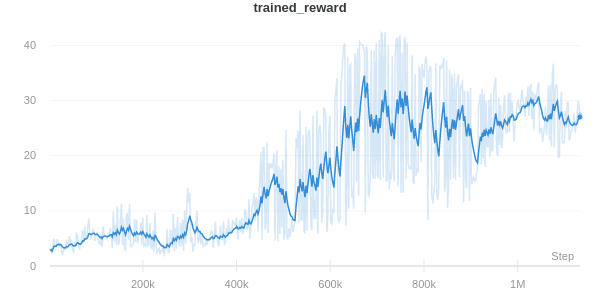

# Meta Learning Shared Hierarchies in PyTorch

## Description

This repo is an implementation of [Meta Learning Shared Hierarchies](https://arxiv.org/abs/1710.09767) using pytorch.

## Installation

1. Copy gym from the [original repo](https://github.com/openai/mlsh) of MLSH and run `pip install -e .` inside that directory
2. Install `test_envs` following the instructions from [original repo](https://github.com/openai/mlsh)

## Dependices

- pytorch
- wandb
- mujoco-py
- Python3.6
- pyglet 1.3.1

## Running experiments

cd into `code` and run
```
python train.py -W 60 -U 1 --env MovementBandits-v0
```
Change `-W` to adjust warm-up period length and `-U` to adjust joint update period. Use `--env` to specify the environment to run experiment on. More options and usages can be find `train.py`  

## Results
- MovementBandit
  - Learning curve
    |Task 1|Task 0|Both Task|
    |------|------|---------|
    ||||
  - Videos (after training for 500 episodes)
    | Task| high-level policy initialized| high-level policy trained| 
    |-----|------------------------------|--------------------------|
    |    0|||
    |    1|||
- AntBandits
  - Learning curve
    |Task [5 0]|Task [0 5]|Both Task|
    |----------|----------|---------|
    ||||
  - Videos (after training for 50 episodes)
    | Task| high-level policy initialized| high-level policy trained| 
    |-----|------------------------------|--------------------------|
    |[5 0]|||
    |[0 5]|||


## References
- [Meta Learning Shared Hierarchies](https://arxiv.org/abs/1710.09767)