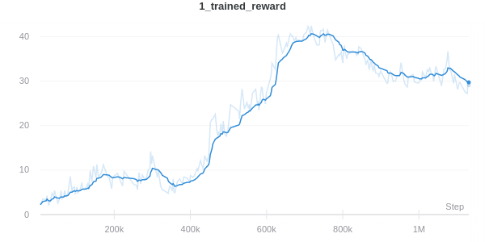
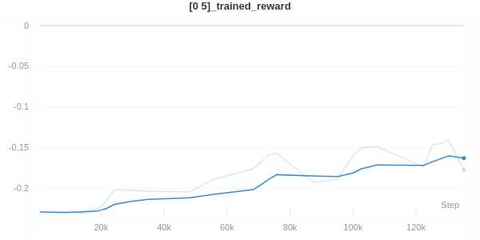

# Meta Learning Shared Hierarchies in PyTorch

## Description

This repo is an implementation of [Meta Learning Shared Hierarchies](https://arxiv.org/abs/1710.09767) using pytorch.

MLSH is a hierchical model that is able to find a set of low-level motor primitives that enable the high-level master policy to be learned quickly for each task sampled from a task distribution

The architecture of MLSH is illustrated in the graph below. It consits of a high-level policy which is parameterized by $\theta$ that needs to be learned from strach per-task and a set of low-level policies parameterized by $\{\phi_i\}$ that are shared between all tasks and held fixed at test time. During rollout, high-level policy selects a low-level policy to activate, then for the next $N$ time step, actions are taken accroding to the output of the activated low-level policy.


MLSH trains the agent by reinitializing the high-level policy whenever a new task is sampled from the given distribution. It then goes through a warmup period in which only high-level policy is updated then a joint update period where both high-level and low-level policies are updated. It repeats the above process untill convergence.

The full algorithm is as follows:


This implementation uses the environments implemented by the original authors of MLSH. All of those environments are copied into this repo(in `test_env` and `gym`) for easier installation.


## Installation
1. run `pip install -r requirements.txt`
2. Add to your `.bash_profile` (replace ... with path to directory):
    ```
    export PYTHONPATH=$PYTHONPATH:/.../mlsh-proj/gym;
    export PYTHONPATH=$PYTHONPATH:/.../mlsh-proj/rl-algs;
    ```
3. `cd` into `gym` then run `pip install -e .` inside that directory.
4. `cd` into `test_envs` then run `pip install -e .` inside that directory.

## Dependices

- pytorch 1.5.0
- wandb 0.8.36
- mujoco-py 0.5.7
- MuJoCo 1.3.1
- Python3.6
- pyglet 1.3.1

## Running experiments

cd into `code` and run
```
python train.py -W 60 -U 1 -T 50 --env MovementBandits-v0
```
Change `-W` to adjust warm-up period length, `-U` to adjust joint update period, and `-T` for lengh of each rollout episode. Use `--env` to specify the environment to run experiments on, `AntBandits-v1` and `MovementBandits-v0` are supported. More options and usages can be find by running `python train.py -h`

## Results
- MovementBandit <br>
  - In this environment, an agent is placed in a world and shown the positions of two randomly placed points. The agent may take discrete actions to move in the four cardinal directions, or opt to stay still. One of the two points is marked as correct, although the agent does not receive information on which one it is. The agent receives a reward of 1 if it is within a certain distance of the correct point, and a reward of 0 otherwise.
  - Learning curves
    |Task Yellow|Task Purple|Both Task|
    |------|------|---------|
    ||||
  - Videos (after training for 500 episodes) <br>
    **high-level policy initialized**: Video generaged when high-level policy is randomly initialized<br/>
    **high-level policy trained**: Video generated after warm-up period when high-level policy is trained to convergence.
    | Task| high-level policy initialized| high-level policy trained| 
    |-----|------------------------------|--------------------------|
    |Yellow|||
    |Purple|||
- AntBandits <br>
  - In this environment, ant must maneuver towards red goal point, either towards the top or towards the right.
  - Learning curves
    |Task Right|Task Up|Both Task|
    |----------|----------|---------|
    ||||
  - Videos (after training for 50 episodes)<br>
    **high-level policy initialized**: Video generaged when high-level policy is randomly initialized<br/>
    **high-level policy trained**: Video generated after warm-up period when high-level policy is trained to convergence.
    | Task| high-level policy initialized| high-level policy trained| 
    |-----|------------------------------|--------------------------|
    |Right|||
    |Up   |||


## References
- [Meta Learning Shared Hierarchies](https://arxiv.org/abs/1710.09767)
- [Original code for MLSH](https://github.com/openai/mlsh)